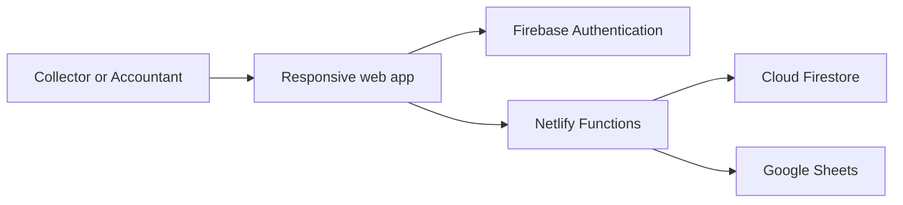

# Daily Cash Tracker

A responsive cash collection and audit application built to turn a manual daily reconciliation process into a simple role-based workflow.

This repository is a sanitized portfolio edition. It contains no production credentials, company data, real employee names, or private spreadsheet identifiers.

## What the application does

- Collector dashboard for driver collections, deposits, store payments, and cash on hand
- General Accountant dashboard with collected cash, paid expenses, deposits, and remaining cash
- Admin role management for registered users
- Movement editing, deletion confirmation, and accountant approval or flagging
- Persistent driver management with Cloud Firestore
- Automatic accountant refresh
- End-of-day deposit calculation without saving physical cash as a normal transaction
- Firebase email/password authentication and password reset
- Google Sheets synchronization grouped by date
- Responsive desktop, tablet, and phone layouts

## My contribution

I identified the operational problem, defined the user roles and workflow, configured the cloud services, tested the application, investigated deployment errors, and iterated on the user experience. AI-assisted development was used for implementation, debugging, test generation, and code review. See [AI_USAGE.md](AI_USAGE.md) for the full disclosure.

## Technology

- Vanilla JavaScript, HTML, and CSS
- Firebase Authentication and Cloud Firestore
- Firebase Admin SDK
- Google Sheets API
- Netlify Functions
- Node.js and the Node test runner

## Architecture



The browser contains only Firebase web configuration. Firebase Admin and Google service-account credentials remain server-side as Netlify environment variables.

## Local setup

1. Install Node.js 20 or newer and run `npm install`.
2. Create a Firebase project, enable Email/Password authentication, and create Firestore.
3. Replace the placeholders in `public/firebase-config.js` with your Firebase web-app configuration.
4. Enable the Google Sheets API and share a test spreadsheet with the service account as Editor.
5. Copy `.env.example` to `.env` and add your own values.
6. Run `npm run dev`.

## Required server environment variables

| Variable | Purpose |
| --- | --- |
| `ADMIN_EMAIL` | Email that receives the Admin role |
| `FIREBASE_SERVICE_ACCOUNT_JSON` | Server credential for Firebase Admin and Google Sheets access |
| `GOOGLE_SHEET_ID` | ID of the spreadsheet used by the test deployment |

Do not commit `.env`, service-account JSON files, private keys, or real financial data.

## Testing

```bash
npm test
npm run build
```

The automated checks cover required roles, movement types, responsive styling, password reset, accountant totals, secure edit/delete behavior, and deployment routing.

## Deployment

1. Import the repository into Netlify.
2. Add the three server environment variables listed above.
3. Deploy using the included `netlify.toml` configuration.
4. Add the Netlify domain to Firebase Authentication's authorized domains.

## Portfolio note

The original application was designed around a real cash reconciliation workflow. All organization-specific branding, names, identifiers, credentials, and operational records were removed from this public edition.

Created by Ahmed Almaghrabi.
